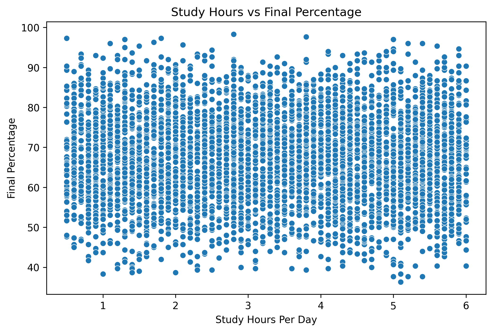
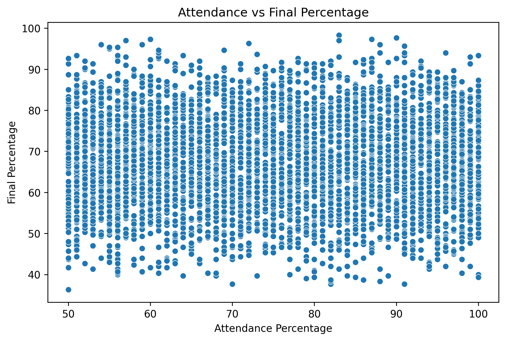
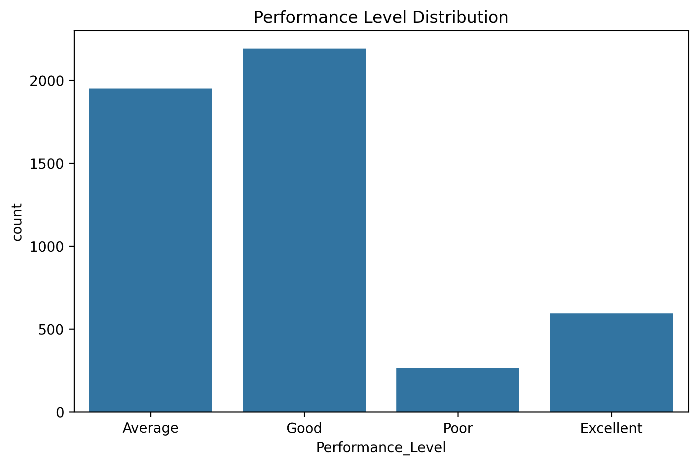
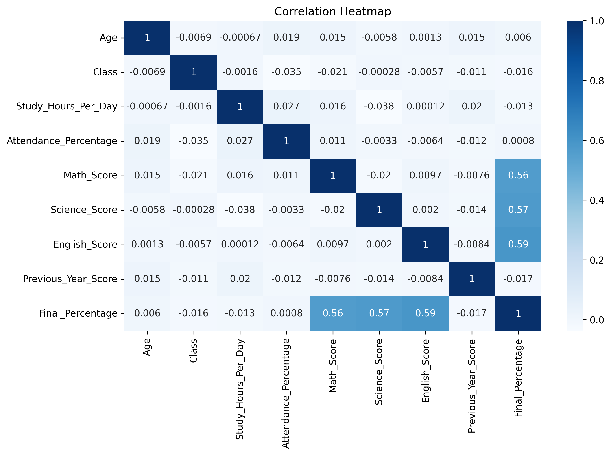

# 🎓 Student Marks Prediction Using Machine Learning


---

# 📌 Project Overview

This project focuses on analyzing and predicting student academic performance using Machine Learning techniques in Python.

The project includes:
- Data Cleaning
- Exploratory Data Analysis (EDA)
- Data Visualization
- Correlation Analysis
- Machine Learning Prediction
- Performance Evaluation

The goal of this project is to understand how study habits and attendance affect student performance.

---

# 🚀 Technologies Used

- Python
- Pandas
- NumPy
- Matplotlib
- Seaborn
- Scikit-learn
- Jupyter Notebook

---

# 📂 Project Structure

student-marks-prediction
│
├── data
│   └── student_data.csv
│
├── images
│   ├── study_vs_percentage.png
│   ├── attendance_vs_percentage.png
│   ├── performance_distribution.png
│   └── heatmap.png
│
├── notebook
│   └── student_analysis.ipynb
│
├── README.md
├── requirements.txt
└── .gitignore

---

# 📊 Data Visualization

# Student Marks Prediction

## Study Hours vs Final Percentage



## Attendance vs Final Percentage



## Performance Distribution



## Correlation Heatmap


---

# 🤖 Machine Learning Model

This project uses:

✅ Linear Regression

to predict student marks based on:
- Study Hours
- Attendance Percentage

---

# 📈 Features Implemented

✅ Data Cleaning  
✅ Data Analysis  
✅ Data Visualization  
✅ Correlation Heatmap  
✅ Marks Prediction  
✅ Performance Analysis  
✅ Graph Exporting  

---

# ▶️ How to Run the Project

## 1️⃣ Clone Repository

```bash
git clone https://github.com/kiruthika-baskaran/student-marks-prediction.git
```

---

## 2️⃣ Install Dependencies

```bash
pip install -r requirements.txt
```

---

## 3️⃣ Run Jupyter Notebook

```bash
jupyter notebook
```

Open:

```bash
student_analysis.ipynb
```

---

# 📌 Future Improvements

- Add advanced Machine Learning models
- Build Streamlit web application
- Deploy project using AWS
- Create interactive dashboard

---

# 👩‍💻 Author

## Kiruthika Baskaran

Aspiring Data Scientist | Python | SQL

---

# ⭐ Project Status

✅ Completed Beginner Data Science Project
